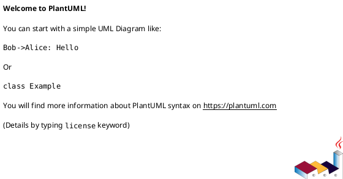
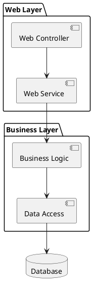
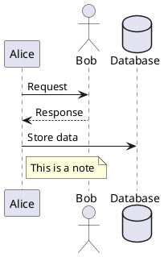
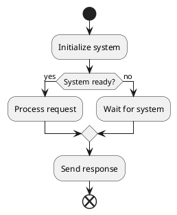
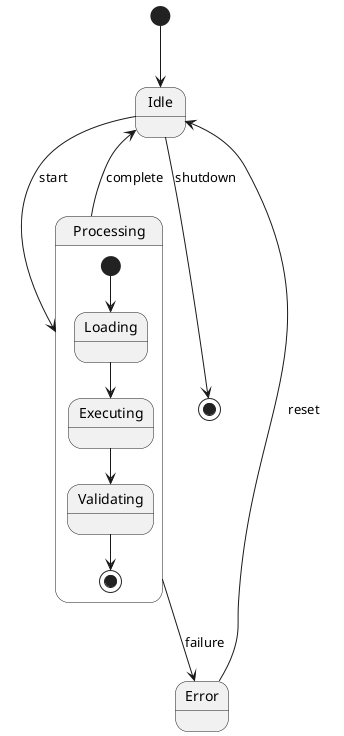

# PlantUML Reference Guide for HH-Copilot Agent

> **MANDATORY**: Agent MUST read this file before creating or editing any `.puml` file.
> Source: PlantUML Comprehensive LLM Cheat Sheet (github.com/jacobh) + plantuml.com docs

---

## 1. Universal Syntax Fundamentals

### Basic Structure



### Core Conventions

- **Comments**: `'` (single line) or `/' ... '/` (multi-line block)
- **String handling**: Use `"quotes"` for names with spaces/special chars
- **Aliases**: `as` keyword creates short references
- **Colors**: `#hexcode`, `colorname`, or gradients `#color1|color2`
- **Styling**: Inline `#color` or global `skinparam`
- **Line breaks in labels**: `\n`

### Essential Patterns

```plantuml
' Variable naming (preprocessing)
!$variable = "value"

' Color application
element #color
element #back:color;line:color;text:color

' Multiline text
"First line\nSecond line"

' Aliases for complex names
component "Complex System Name" as CSN
```

---

## 2. Diagram Types Reference

### 2.1 Component Diagrams (primary for HH-Copilot architecture)



**Key Elements:**
- `component [Name] as ALIAS` -- rectangular component
- `package "Name" { ... }` -- grouping
- `interface "Name" as ALIAS` -- provided/required interfaces
- `database "Name" as ALIAS` -- cylinder shape
- `node "Name" as ALIAS` -- deployment node
- `cloud "Name" as ALIAS` -- cloud shape
- `rectangle "Name" as ALIAS` -- simple rectangle
- `[Name]` -- shorthand component

**Component connections:**
- `A --> B` -- dependency
- `A ..> B` -- dependency (dashed)
- `A -- B` -- link (solid)
- `A .. B` -- link (dashed)
- `A -[#color]> B` -- colored arrow
- `A --> B : label` -- labeled arrow

**Interfaces:**
```plantuml
component WebApp
interface "HTTP" as HTTP
WebApp -right-> HTTP
```

### 2.2 Sequence Diagrams (for data flow)



**Participants**: `participant`, `actor`, `boundary`, `control`, `entity`, `database`, `collections`, `queue`

**Arrows:**
- `->` solid, `-->` dashed
- `->>` thin, `->o` circle
- `-x` lost
- `<->` bidirectional

**Activation**: `activate`/`deactivate` or `++`/`--`

**Grouping**: `alt`/`else`/`end`, `opt`, `loop`, `par`, `group`, `critical`

**Auto-numbering**: `autonumber [start] [increment] ["format"]`

**Notes**: `note left/right/over : text`

### 2.3 Activity Diagrams (for workflows)



**Control Structures:**
- Conditionals: `if`/`then`/`else`/`endif`
- Switches: `switch`/`case`/`endswitch`
- Loops: `repeat`/`repeatwhile`, `while`/`endwhile`
- Parallel: `fork`/`fork again`/`end fork`
- Partitions: `partition "Name" { ... }`
- Swimlanes: `|Actor| :action;`

### 2.4 State Diagrams



---

## 3. Styling and Themes

### Skinparam (Global Styling)

```plantuml
skinparam {
  backgroundColor #E8F4FD
  defaultFontSize 12
  defaultFontName Arial
  ArrowColor #94A3B8
  ArrowThickness 1.2
  Padding 6
  RoundCorner 8
}
```

**Common skinparam categories:**
- `skinparam componentStyle rectangle` -- force rectangle style
- `skinparam packageStyle rectangle` -- rectangle packages
- `skinparam package { BackgroundColor ... BorderColor ... }`
- `skinparam sequence { ParticipantBorderColor ... MessageAlign ... }`
- `skinparam class { BackgroundColor ... BorderColor ... }`

### Inline Styling

```plantuml
' Color syntax: #[background];line:color;line.style;text:color
class Important #red;line:black;line.bold;text:white
component Service #lightblue;line:blue;line.dashed
```

### Themes

```plantuml
!theme plain
' Other themes: cerulean, mars, sketchy, toy, vibrant
```

---

## 4. Preprocessing System

### Variables and Functions

```plantuml
!$company = "Acme Corp"
!$version = 1.2

!function $header($title)
!return $title + " v" + $version
!endfunction

title $header("System Architecture")
```

### Conditional Logic

```plantuml
!$environment = "production"
!if $environment == "production"
  skinparam backgroundColor lightgreen
!else
  skinparam backgroundColor lightcoral
!endif
```

### Includes

```plantuml
!include https://raw.githubusercontent.com/.../file.puml
!include local-file.puml
```

---

## 5. LLM Best Practices (MANDATORY)

### 5.1 Approach Strategy

**Start Simple, Add Complexity:**
1. Phase 1: Basic structure (nodes + connections)
2. Phase 2: Add details (labels, notes, grouping)
3. Phase 3: Add styling and colors

### 5.2 Error Prevention Patterns

**Safe Naming:**
```plantuml
' GOOD: Use aliases for complex names
component "Complex-System_Name (v2.1)" as CSN
database "User Database Server" as UDB

' BAD: Special characters in direct references
' component Complex-System_Name (v2.1)  -- WILL CAUSE ISSUES
```

**Quote Management:**
```plantuml
' Always quote names with spaces or special chars
participant "User with spaces" as User
actor "Admin (Super)" as Admin
```

### 5.3 Layout Control

```plantuml
' Direction control
left to right direction
top to bottom direction

' Group related elements
together {
  class A
  class B
}

' Force layout with hidden connections
A -[hidden]-> C

' Package organization
package "Layer 1" {
  class Service1
}

' Spacing control
skinparam nodesep 50
skinparam ranksep 50
```

### 5.4 Responsive Design

```plantuml
scale 1.2
skinparam maxMessageSize 100
skinparam wrapWidth 200

' Use meaningful short names
participant "Long Service Name" as LSN
```

---

## 6. Quick Reference: Arrow Types

| From/To | Solid | Dashed | Note |
|---------|-------|--------|------|
| General | `-->` | `..>` | Dependency |
| Sequence | `->` | `-->` | Message |
| Component | `-->` | `..>` | Connection |
| Class | `-->` | `..>` | Dependency |
| Use Case | `-->` | `..>` | Association |

## 7. Quick Reference: Color Notation

| Method | Example | Usage |
|--------|---------|-------|
| Hex | `#FF0000` | Precise colors |
| Named | `red`, `lightblue` | Common colors |
| Gradient | `#red\|blue` | Background gradients |
| Inline | `#back:color;line:color` | Complex styling |

## 8. Quick Reference: Diagram Type Keywords

| Type | Start | End | Purpose |
|------|-------|-----|---------|
| UML | `@startuml` | `@enduml` | General UML diagrams |
| Gantt | `@startgantt` | `@endgantt` | Project schedules |
| MindMap | `@startmindmap` | `@endmindmap` | Mind mapping |
| JSON | `@startjson` | `@endjson` | Data display |
| YAML | `@startyaml` | `@endyaml` | Data display |

---

## 9. Troubleshooting

### Common Syntax Issues

| Issue | Cause | Fix |
|-------|-------|-----|
| Parsing error | Unclosed quotes | Close all `"quotes"` properly |
| Invalid characters | Hyphens/parens in names | Use `"quotes"` or `as` aliases |
| Poor layout | Auto-layout fails | Use `left to right direction`, hidden arrows |
| Text overflow | Long labels | Set `skinparam wrapWidth 150` |

### Verification Checklist

Before committing any `.puml` file:
1. Every `@startuml` has matching `@enduml`
2. All quotes are properly closed
3. No unquoted names with spaces/special chars
4. All aliases defined before use
5. Colors use valid hex or named colors
6. No trailing whitespace in arrow definitions

---

## 10. HH-Copilot Conventions

### Architecture Diagram Conventions

- Use `!theme plain` for clean look
- Use `skinparam componentStyle rectangle`
- Package colors: pastel backgrounds (`#EFF6FF`, `#F0FDF4`, `#FEF3C7`, etc.)
- Arrow color: `#94A3B8` (slate-400)
- Arrow thickness: `1.2`
- Component names: `filename.js` + brief description
- Title format: `HH-Copilot vX.X.X -- Diagram Name`
- Comment significant connections with `'` comments
- Group modules by subsystem (parsers, engine, lib, ui)

### File Naming

- `NN-description.puml` (NN = sequence number)
- Store in `docs/puml/` or project download dir

---

*Source: PlantUML Comprehensive LLM Cheat Sheet (github.com/jacobh/e4f49c01ebc465483fcce7187c06e114)*
*Last updated: 2026-06-13*
